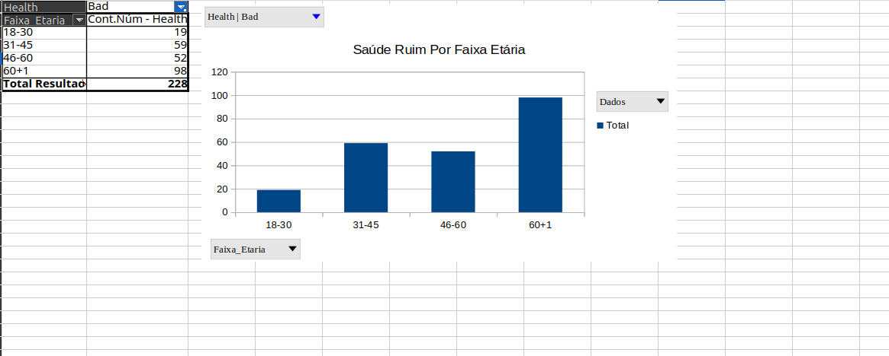
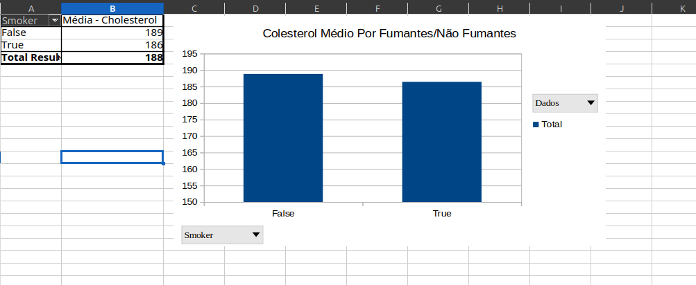
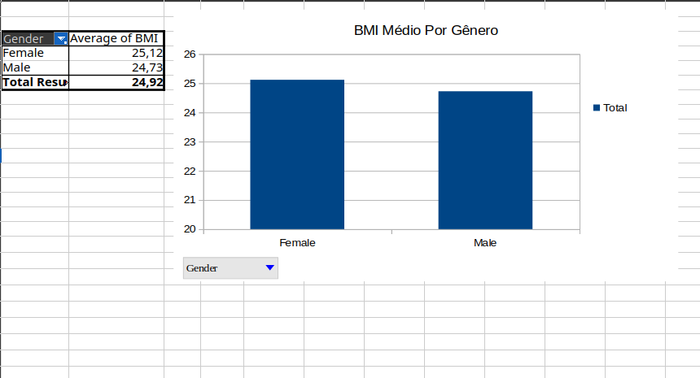
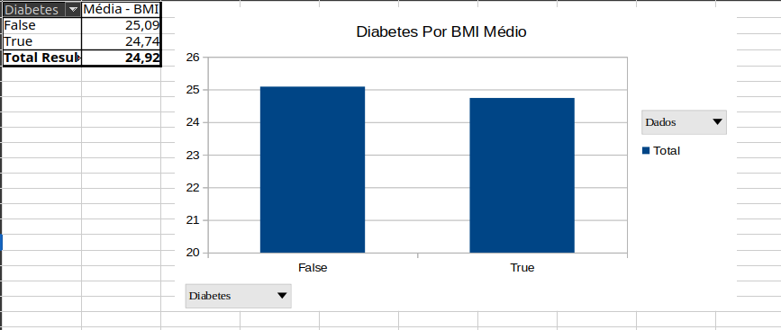
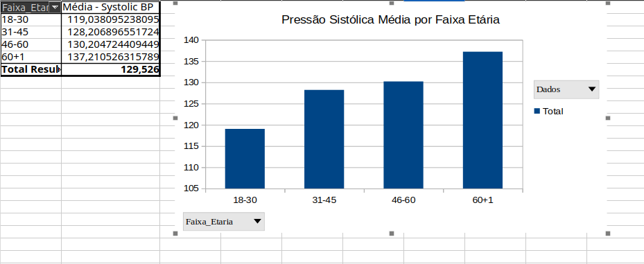

# analise-saude-excel

Projeto de análise de dados em Excel com foco em indicadores de saúde por faixa etária, gênero e fatores de risco.

## 🎯 Objetivo do Projeto

Analisar dados de saúde para identificar padrões relacionados a:
- Faixa etária
- Gênero
- Índice de Massa Corporal (BMI)
- Colesterol
- Diabetes
- Pressão arterial

O objetivo é demonstrar habilidades em organização de dados, criação de gráficos e interpretação de indicadores de saúde.

## 🛠️ Ferramentas Utilizadas

- Microsoft Excel
- Gráficos dinâmicos
- Tabelas dinâmicas
- Fórmulas e organização de dados

## 📊 Exemplos de Gráficos Gerados

### Saúde Ruim por Faixa Etária

### Colesterol Médio por Grupo

### BMI por Gênero

### Relação entre Diabetes e BMI

### Pressão Arterial por Faixa Etária

## 🧠 Principais Insights Encontrados

- Observa-se aumento significativo de casos de saúde ruim nas faixas etárias mais altas, indicando maior vulnerabilidade com o avanço da idade.

- O colesterol médio apresenta variação entre os grupos, sugerindo que determinados perfis podem ter maior risco cardiovascular.

- A distribuição de BMI por gênero mostra diferenças relevantes, o que pode indicar padrões distintos de sobrepeso e obesidade entre homens e mulheres.

- A análise entre diabetes e BMI sugere uma correlação positiva, onde indivíduos com BMI mais elevado apresentam maior incidência de diabetes.

- A pressão arterial tende a aumentar conforme a faixa etária, reforçando a importância do monitoramento em populações mais velhas.

## 📁 Estrutura do Repositório

- `planilhas/` → Arquivos do projeto em Excel
- `imagens/` → Gráficos exportados
- `dados/` → Documentação ou dados auxiliares

## 📌 Autor

Antônio Carlos - Estudante de ADS
